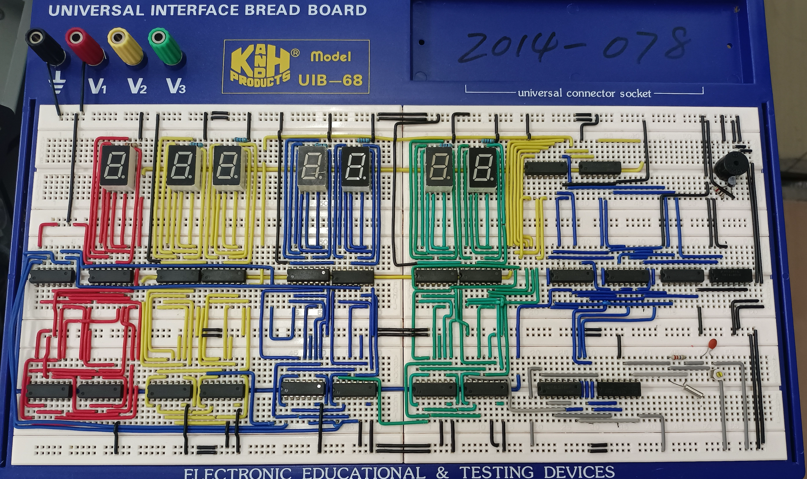
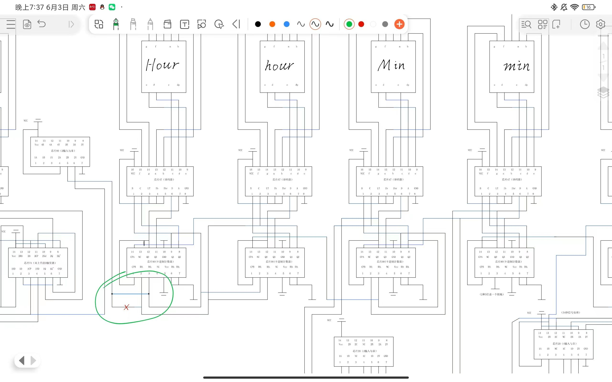

# **数字时钟课设**
上次更新：2024-7-6

## 4院
[main.zip](./4院/main.zip)

## 18院
此课设实现： 天 时 分 秒 54秒开始报时 4短1长

### 1.效果图

[接线实物图.zip](./18院/接线实物图.zip)

### 2.接线图
[电路接线示意图.pdf](./18院/电路接线示意图.pdf)

强烈建议使用Adobe Acrobat等工具打开

此图基本无错误，只需改两处（时进位天部分、报时控制长短部分）

自行研究，并不困难，反正你最后都得懂原理

接线过程、面包板 都可能导致出现疑难杂症，请耐心慢接

### 3.实验报告
[电工电子课设----数字钟的设计与制作.pdf](./18院/电工电子课设----数字钟的设计与制作.pdf)

## 其他学院

[数字电路课程设计.pdf](./其他学院/数字电路课程设计.pdf)