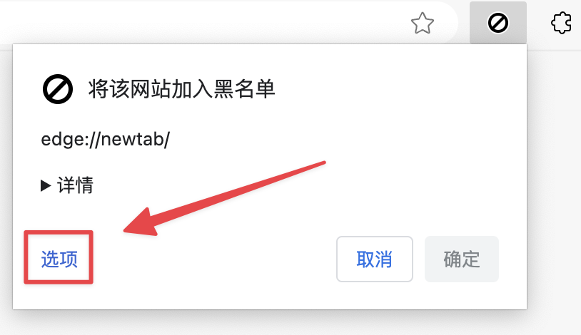
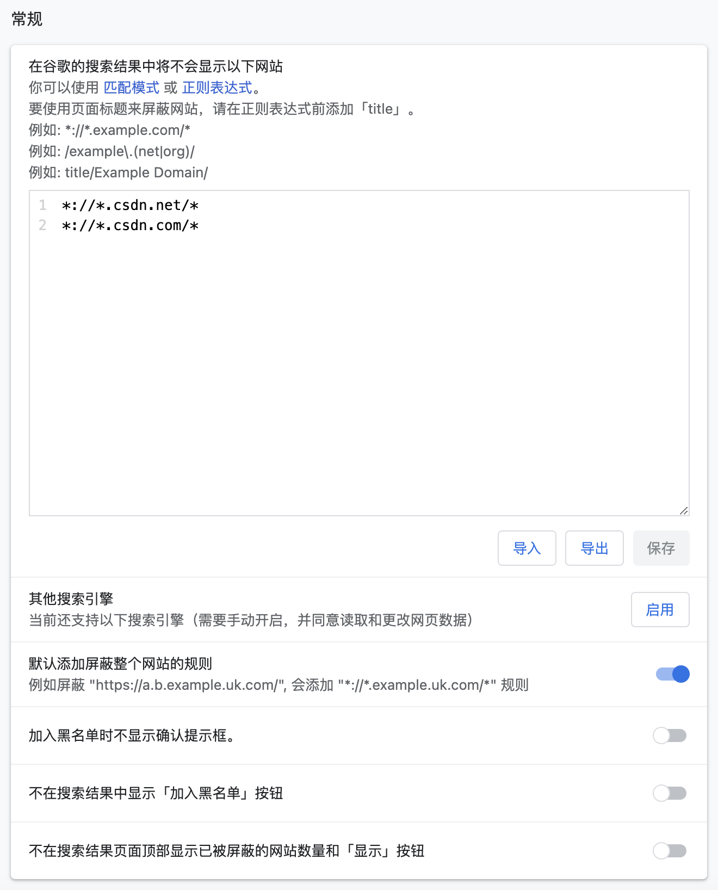

# 屏蔽CSDN网站
上次更新：2024-8-11
>🧐CSDN 是什么？（就是你熟知的那个网站）</br>
Copy(复制) + Steal(剽窃) + pay-Download(下载付费) + Net(网)
## 一、为什么屏蔽 ？
如果你有能力翻墙的话，可以看看这篇文章 [知识付费就是一个笑话。](https://v2ex.com/t/985433)

其 **恶行** 包括但不限于：
- 搬运免费公开文章 转为 **付费方可阅读**
- 搬运免费公开文章 转为 **登陆方可复制**
- 作者原创免费文章 系统自动转为 **VIP 可读文章**

</br>

诚然，很多朋友可能第一次在百度等搜索引擎上搜一些问题时，第一个接触到的网站就是 CSDN

你可能会发现他的内容很多，覆盖面很广泛

起初，这个平台有很多大佬写了很多原创文章，对早期网民的帮助很大

但是，现如今，其绝大多数内容，均为抄袭搬运，并非原创于该平台

</br>

很抱歉，也许你在看到我写的这篇文章之前，还觉得它是一个很好的平台

我也认同，它肯定给予了你很多帮助

但是，我不得不告诉你这个真相，这个只有互联网深度用户（尤其是开发者）才会去了解的真相

</br>

你可以在互联网上搜到很多喷 CSDN 的文章，这并非空穴来风、凭空捏造

只是你们大多数人并非 利益既得者 ，无法深刻体会到它的 恶

我上面只是很简略的总结了他的恶，如果你真的感兴趣，我建议你自己去查一查资料

另外，别用百度

</br>

如果你经常在网络上查计算机相关的资料，可能听说过 [博客园](https://www.cnblogs.com/)

这个平台完全没有 CSDN 的恶行，也正因如此，没有足够的资金支持，如今面临着随时关站的结局（不过最近有大佬赞助，还能”苟活”）

这个平台有太多的好文章，也是 CSDN 搬运的重灾区，如果你有兴趣，建议了解了解

## 二、怎么屏蔽 ？

>诚然，很多朋友是经常依赖 CSDN 完成任务的。第三部分会告诉你屏蔽后怎么办。

### 1. 安装插件

>根据不同浏览器选择

[Chrome / Edge](https://chromewebstore.google.com/detail/ublacklist/pncfbmialoiaghdehhbnbhkkgmjanfhe)

[Firefox](https://addons.mozilla.org/en/firefox/addon/ublacklist/)

[Safari](https://apps.apple.com/us/app/ublacklist-for-safari/id1547912640)

[GitHub](https://github.com/iorate/ublacklist/)

### 2. 设置插件
点击 **选项**



添加屏蔽规则，然后点击 **保存** 即可生效

```JavaScript
*://*.csdn.net/*
*://*.csdn.com/*
```



完成后，在搜索结果中，每条链接后面也会出现一个选项 **加入黑名单** ，方便快速屏蔽当前链接

同时你也可以恢复被屏蔽的内容

## 三、那么我应当去哪里寻找答案

### 1. 使用正确的搜索引擎

建议使用 Bing、Google、DuckDuckGo 搜索引擎

国产搜索引擎都是垃圾（搜索政治问题、作业题目等可以）

### 2. 访问正确的网站

关于编程问题，你可以去看看这些网站：

- [StackOverFlow](https://stackoverflow.com/)
- [Stack Exchange](https://stackexchange.com/)
- [SegmentFault 思否](https://segmentfault.com/)
- [博客园](https://www.cnblogs.com/)
- [简书](https://www.jianshu.com/)
- 个人博客网站

它们往往都没有 CSDN 那么多恶行（抄袭搬运、付费下载、登陆复制）