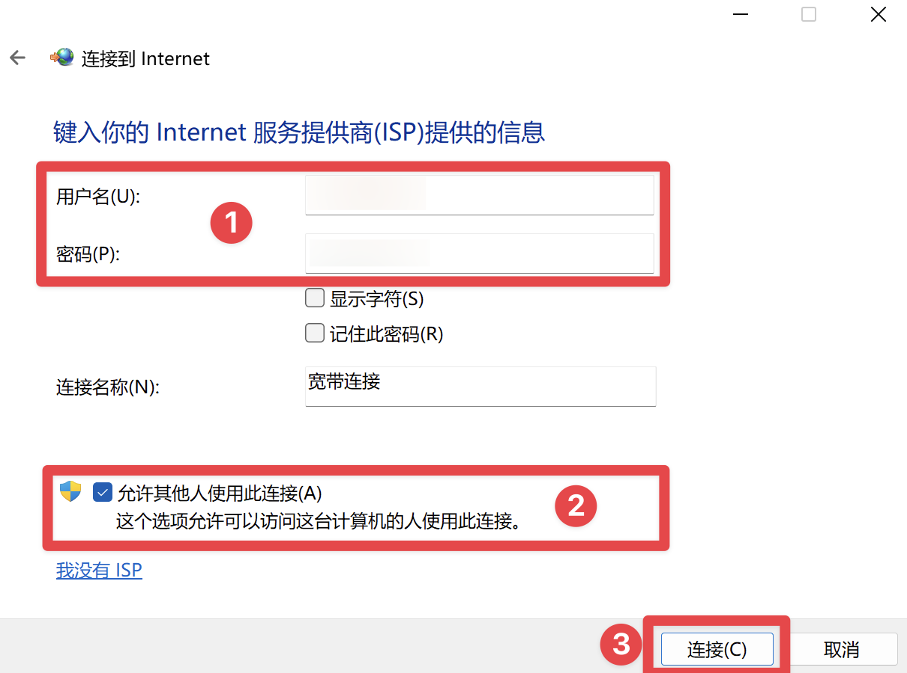
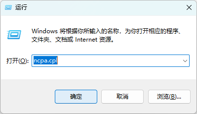
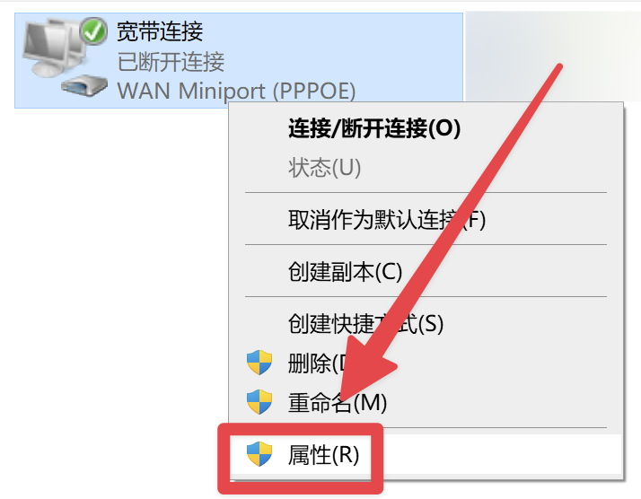
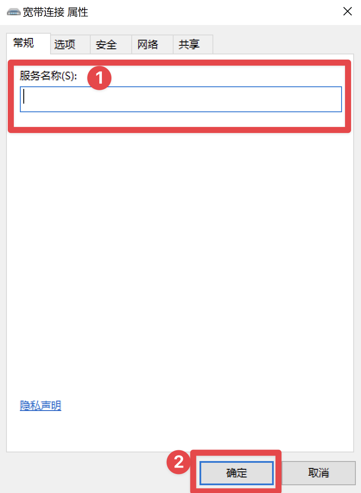

# 设置有线网络/宽带/拨号上网
上次更新：2024-8-31
# 〇、前言
- 校园内宽带共有四种：
    - 校园网宽带
    - 移动宽带
    - 联通宽带
    - 电信宽带
- 宽带账号密码：
    - 校园网，与 i 南航 账号密码一致
    - 其他，咨询运营商办理人员
- 宽带服务名
    - 校园网为 nuaa
    - 移动宽带为 njmobile
    - 联通宽带为 njlt
    - 电信宽带为 njdx 或 njxy
# 一、设置教程
## 1.Windows 10 / Windows 11
1、按下 ``Windows 键 + R ``，输入 ``ms-settings:network-dialup`` ，点击 **确定**

2、会弹出 **设置-拨号** 界面

3、点击 **设置新连接**

4、先点击 **连接到Internet** ，再点击 **下一页**

5、点击 **宽带(PPPoE)(R)**

6、先输入你的宽带账号密码，再勾选 **允许其他人使用此连接** ，点击 **连接**

7、连接会失败或其他提示，不需要管，点击 **设置连接** ，然后关闭窗口

8、按下 ``Windows 键 + R`` ，输入 ``ncpa.cpl`` ，点击 **确定**

9、在弹出的窗口找到 **宽带连接** （这个名称取决于第6步的窗口中是否更改 **连接名称** ），右键后点击 **属性**

10、在弹出的窗口中，填写 **服务名称** ，点击 **确定**

11、回到刚才的 **设置-拨号** 界面，找到你创建的拨号连接，点击 **连接**

12、理论上会提示连接成功，不成功就多点几次

如果成功后几秒后断开，就继续点连接，可能会断开1，2次，后续即可正常使用。

如果经常自动断开，换成路由器即可解决。

如果仍然出现报错，请检查是否按照流程、完整填写、正确勾选。

不行可以选择删除连接，重新创建一次。

否则请联系信息化处 ``025-84890123`` 。

## 2.路由器
 
由于不同路由器，设置流程不同，所以不做详细教程。具体请咨询客服或查询说明书
>⚠️必填参数如下，填错或少填 100% 连不上

1. 宽带账号
2. 宽带密码
3. 宽带服务名